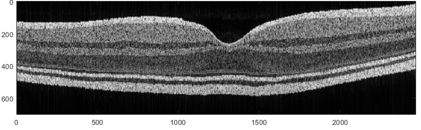
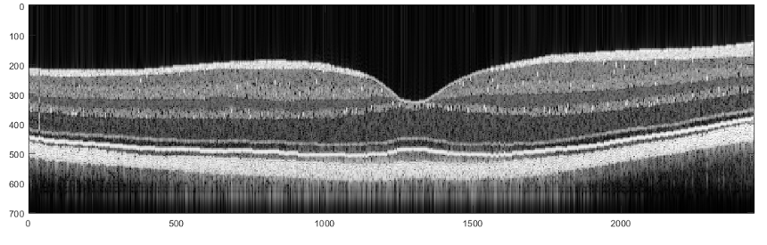

# Retinal B-scan Simulation (from Segmentation)

This module generates **synthetic OCT B-scans** of the retina using real layer geometry extracted from segmented OCT images.

The pipeline uses:

- A **segmented retina** (saved in a `.mat` file, e.g. `bscn.nI`)  
- The **multilayer Fresnel OCT forward model**  
- Spectral-domain OCT simulation and FFT reconstruction  

Two different B-scan simulation strategies are implemented:

1. **Pixel-based model** – directly assigns refractive index to each depth pixel of each layer.
2. **Cluster-based model** – uses an anatomically inspired cluster model inside each layer (similar to the random A-scan cluster-based simulator).

---

## Folder structure

- `pixel_based/`  
  Pixel-wise B-scan simulation using per-layer refractive-index noise.

- `cluster_based/`  
  Cluster-based B-scan simulation with layer-specific cluster formation and bright spots.

Each subfolder has:

- A main script (`bscan_*.m`)  
- A `README.md` describing the details of that model

---

## Input segmentation

Both models assume a `.mat` file containing a segmented retina, e.g.:

```
file = '...path...\_cropno_1250592_3_E copy.mat';
bscn = load(file);
```

with a field like: bscn.nI – matrix where non-zero values indicate retinal tissue, column-wise A-scan.

For each A-scan (column), the code:
- Finds non-zero vertical regions
- Converts them into layer thicknesses (pixel counts)
- Uses these thickness profiles to build a multilayer refractive-index model along depth.

---

## OCT forward model (shared ideas)

Both pixel-based and cluster-based models:
- Define a source spectrum around 840 nm with a specified bandwidth and FWHM.
- Set up a spectrometer sampling and SBW model (d_sbw, sbw_convertor).
- Use a multilayer model (`General_Multilayer_Fresnel_V10` or `V11`) to compute:
  - Sample arm field Er
  - Reference arm (ErR or Reference_Mirror)
  - Form a spectral interferogram
  - Map it through the spectrometer model
  - Reconstruct the B-scan using OCT_Analyse, producing:
    - Xaxis (depth axis)
    - Depth (A-scan intensity)

The individual A-scans are stacked into B_Depth, and then converted to dB for visualization:
- `bscan_db = 10*log10(B_Depth + 1e-5);`

---

## Example B-scan Outputs

Below are example B-scans generated by both pixel-based and cluster-based retina models.

| Pixel-based model | Cluster-based model |
|-------------------|---------------------|
|  |
| |
|-------------------|---------------------|

---

## Recommended usage

Use cluster-based B-scan:
- more realistic intra-layer structure (clusters, environments, bright spots).
- For generating anatomically inspired synthetic B-scans for deep-learning datasets.
