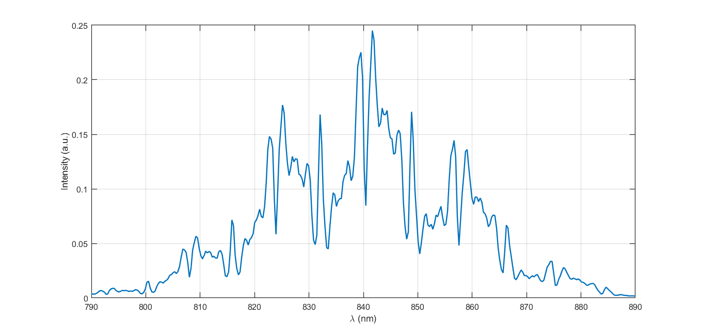

# Part 1 – Multilayer OCT Simulation with Fresnel Coefficients

This folder contains the first part of the project: a geometric-optics based simulation of OCT signals using multilayer Fresnel reflections.  
It includes both the **optical reflection model** and a **simplified OCT forward model** for generating synthetic A-scans.

---

## Overview

This part of the project has two main components:

### 1. **Multilayer Reflection Profile (Fresnel-based)**

- A multilayer sample (e.g., retina-like layers) is defined using:
  - Refractive indices
  - Layer thicknesses
- Fresnel equations are used to compute reflection and transmission at each interface.
- The output of this step is a **depth-dependent reflection profile** representing how the sample reflects light.

This step provides the physical basis for understanding how OCT contrast arises from refractive index changes.

---

### 2. **OCT Forward Simulation (Interferometric A-scan Generation)**

The reflection profile is then used to simulate a simplified OCT system:

1. A source spectrum is assumed (e.g., Gaussian or rectangular bandwidth).
2. The sample arm field is generated from the reflection profile and propagation delays.
3. A reference arm field is added.
4. The two fields interfere.
5. The spectrometer records the interferometric spectrum, with its SBW limiting the axial resolution.
6. Standard OCT processing is applied:
   - Resampling 
   - Windowing
   - FFT

The resulting output is a **synthetic OCT A-scan**, showing peaks at the depths of the layer boundaries.

Only the main physical steps are described here; low-level implementation details (spectral interpolation, normalization, etc.) are handled inside the code.

---

## Folder structure

This folder contains both:
1. The **final multilayer Fresnel model** (computes reflection profile of sample)
2. The **final OCT forward simulator** (generates the A-scan using that profile)
   
```
simulations/
│
├── multilayer_fresnel/
│   ├── General_Multilayer_Fresnel_V11.m
│   ├── prop_V7_vectorized_fullspec.m
│   ├── transfer_V7_vectorized.m
│   ├── README.md           
│   └── versions/
│       ├── General_Multilayer_Fresnel_V7.m
│       ├── General_Multilayer_Fresnel_V71.m
│       └── General_Multilayer_Fresnel_V10.m
│
├── oct_simulation/
│   ├── oct_forward_simulator.m
│   ├── Reference_Mirror.m
│   ├── OCT_Analyse.m         
│   ├── README.md             
│   └── versions/
│       └── oct_forward_simulator_v02.m
│
├── sample_outputs/
│   ├── A_Scan.png    
│   └── spectral_interferogram.png 
               
```
---

## Main scripts (final versions)

### **Multilayer Fresnel Model**  
`multilayer_fresnel/General_Multilayer_Fresnel_V11.m`  
- Computes Fresnel reflection/transmission coefficients.  
- Handles multilayer propagation and multiple reflections.  
- Produces the **reflection spectrum/profile** used by the OCT simulator.

### **OCT Forward Simulator**  
`oct_simulation/oct_forward_simulator.m`  
- Takes the reflection profile from the Fresnel model.  
- Generates the interferometric signal (sample arm + reference arm).  
- Performs FFT-based OCT reconstruction.  
- Outputs the final **synthetic A-scan**. 

---

## Development history (older versions)

Each subsystem has a `versions/` folder:

### In `multilayer_fresnel/versions/`
- `General_Multilayer_Fresnel_V7/`  – fully loop-based  
- `General_Multilayer_Fresnel_V71/` – vectorized interfaces but still loop per wavelength 
- `General_Multilayer_Fresnel_V10/` – multi-wavelength using cell arrays and index tricks  

### In `oct_simulation/versions/`
- `oct_forward_simulator_v02/` – First OCT forward-simulation prototype  
- (More versions may be added)

Each version has a short README describing what changed.

---

## Physical model summary

### Multilayer structure
A stack of layers is defined by:
- \( n_i \): refractive index of layer \( i \)  
- \( d_i \): thickness of layer \( i \)

At each interface, Fresnel equations give:
- reflection coefficient \( r \)
- transmission coefficient \( t \)

### OCT signal formation
For each reflection:
- Phase delay depends on optical path length  
- Reflected fields from all depths interfere  
- Adding the reference arm produces the interferogram  
- FFT of the interferogram recovers the depth-resolved A-scan

---

## How to run

### Generate OCT A-scan

Use the reflection profile generated in Step 1 as input:

```
oct_forward_simulator
```

This script generates the interferometric signal and reconstructs the final A-scan.

---
## Example output

Below is an example of a synthetic OCT A-scan and its spectral interferogram generated using the multilayer Fresnel model and the OCT forward simulator (a random sample):

| Spectral Interferogram profile | Reconstructed A-scan |
|--------------------------------|----------------------|
|  |  |

---

## Purpose within the full project

This simulation forms the foundation for the next stages:

1. **Understanding OCT signal formation** – building intuition about how multilayer structures produce OCT contrast  
2. **Retinal B-scan simulation (Part 2)** – using anatomical retina models  
3. **Dataset generation (Part 3)** – producing synthetic OCT data for training deep networks  
4. **Deep learning models (Part 4)** – denoising, super-resolution, or layer enhancement

This folder implements **Part 1** of the full pipeline.

---
